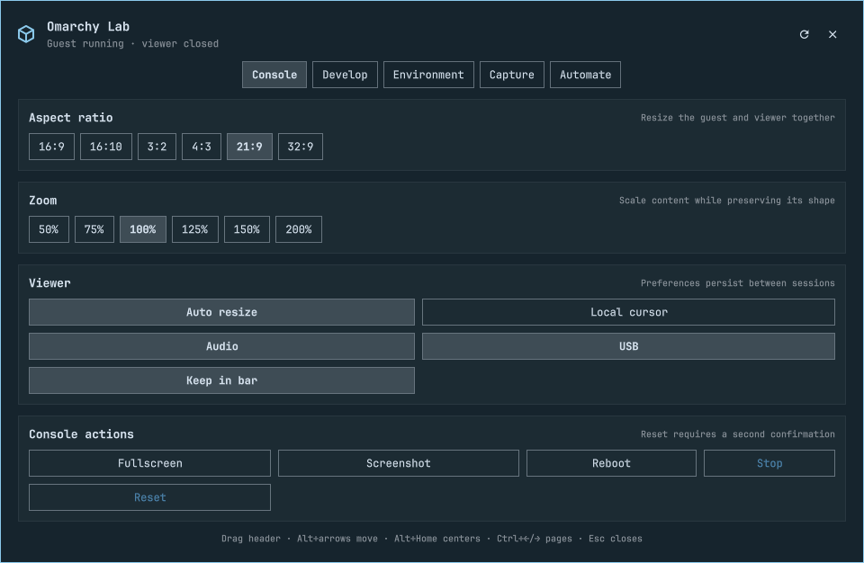
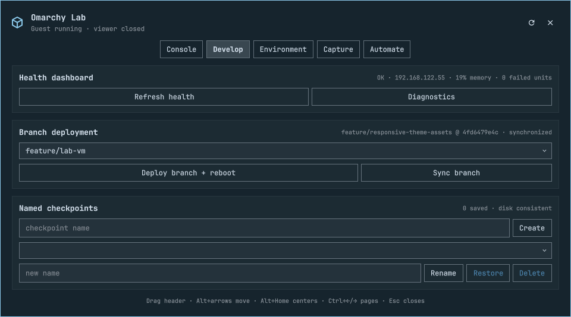
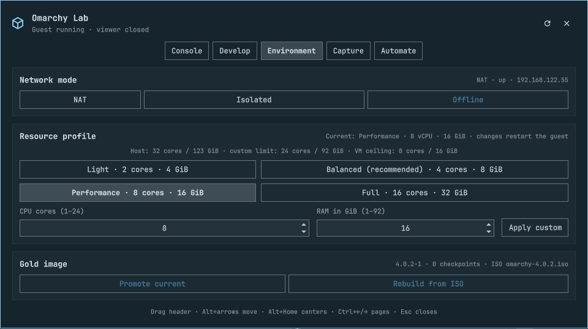

# Omarchy Lab

A disposable Omarchy VM with a native Quickshell workbench: deploy branches, save checkpoints, control resources and networking, and capture what happens in the guest.

An [open PR in Omarchy (#10109)](https://github.com/omacom/omarchy/pull/10109) proposes including Lab by default and is ready for review. It has not been merged; this standalone plugin lets you try it now.

**Early preview for Omarchy Quattro's Quickshell desktop.** This is not a plugin for the older Waybar desktop, and it does not replace or upgrade your host Omarchy installation. No custom Omarchy branch is required, but your host must already provide the Quickshell plugin API, `SearchableDropdown`, and `NumberField` components.

## Screenshots

Console — aspect ratios, zoom, viewer preferences, and VM controls.



<details>
<summary>Develop — branch deployment, health, and checkpoints</summary>



</details>

<details>
<summary>Environment — networking, hardware profiles, and gold images</summary>



</details>

## Install

From a terminal in your Omarchy desktop:

```bash
omarchy plugin add https://github.com/acrogenesis/omarchy-lab --enable
omarchy-shell shell summon acrogenesis.lab '{}'
```

Select **Install Lab VM** on the Console page. The button shows **Opening installer…** while launching, then the workbench closes once the setup terminal is ready for resource choices and authentication. If launching fails, the workbench stays open with an error beside the button. Setup installs the virtualization dependencies, downloads the Omarchy ISO, performs an unattended guest installation, then saves a clean gold disk. This is a substantial download and can take a while.

Requirements: hardware virtualization enabled in firmware, `/dev/kvm`, an internet connection for initial setup, and sufficient disk space. The guest disk defaults to 80 GB **sparse virtual capacity**; the ISO is several GB and gold images/checkpoints require additional real space. Balanced defaults to up to 4 CPU cores / 8 GiB RAM. Smaller hosts cap the allocation downward.

The bar icon normally appears while virt-viewer is open. Turn on **Keep in bar** to retain it after closing the viewer. You can always summon the controls with the command above. After VM installation, **Omarchy Lab** also appears in the app launcher.

### CLI

The commands ship inside the plugin; they do not overwrite Omarchy's commands or require changing `OMARCHY_PATH`:

```bash
LAB="$HOME/.config/omarchy/plugins/acrogenesis.lab"
"$LAB/bin/omarchy-labctl" doctor
"$LAB/bin/omarchy-labctl" controls
"$LAB/bin/omarchy-labctl" vm install
"$LAB/bin/omarchy-labctl" launch
"$LAB/bin/omarchy-labctl" health --json
```

For the shorter `omarchy-labctl` spelling used in the [usage guide](manual/52-lab-vm.md), optionally add a symlink (this deliberately refuses to replace an existing command):

```bash
mkdir -p "$HOME/.local/bin"
ln -s "$HOME/.config/omarchy/plugins/acrogenesis.lab/bin/omarchy-labctl" "$HOME/.local/bin/omarchy-labctl"
```

Keep the plugin in its installed directory: launcher and SSH entries reference its commands there. `ssh omarchy-lab` is configured during VM installation.

## What it does

- **Console:** movable controls, six aspect ratios, zoom, fullscreen, audio/USB/cursor options, reboot, stop and reset.
- **Develop:** searchable local branches, deploy/sync, health, named checkpoints and restore.
- **Environment:** NAT, host-only or offline networking; Light/Balanced/Performance/Full and custom CPU/RAM; gold promotion/rebuild.
- **Capture:** screenshots, recordings, diagnostic bundles, comparisons, clipboard and file transfer.
- **Automate:** guest terminal/launcher shortcuts and argument-array scenarios.

For branch deployment, keep an Omarchy Git checkout at `~/Work/omarchy` (or use the checkout CLI's repository/path options). The dropdown lists **local branches**, not every branch on GitHub. The plugin repository itself is not an Omarchy checkout and must not be deployed as one.

## Safety and limitations

This is a development lab, not a hardened malware-analysis sandbox. The guest intentionally has autologin, an unencrypted disk, and passwordless sudo; the default credentials are **lab / lab**. NAT can reach networks your host can reach. Isolated networking removes the guest's default route but does not provide a guarantee against VM escapes or host attacks. Disable audio/USB/clipboard features when appropriate, and don't put secrets in the guest.

Reset discards the active overlay. Restore replaces it with a saved checkpoint. Promote changes the clean baseline; rebuild reinstalls the guest. Checkpoints are standalone disk images, but virtual TPM state is shared and is **not** rolled back. Destructive controls require confirmation and privileged lifecycle operations authenticate in a visible terminal before deleting data. Back up anything valuable separately.

Recordings capture a composited host-screen rectangle, not a private guest framebuffer. The panel closes and the viewer is raised before recording; keep other windows out of the way. Diagnostic bundles and captures can contain sensitive guest data—review before sharing.

This package reuses the `omarchy-lab` domain, disk names and state paths from the native Lab implementation. Installing it does not create a second independent lab. If you already have the native Lab plugin, use one control panel at a time. Uninstalling the plugin **does not delete your VM**. Remove the VM explicitly with `omarchy-labctl vm remove` before removing the plugin if that is what you intend.

Live-tested: viewer controls, branch deploy/sync and failure handling, checkpoint restore after gold promotion, network transitions, resource changes, transfers, health/Stop races, and terminal lifetime. Regression tests cover destructive failure paths. **A fresh full installation/rebuild and authenticated reset have not yet been rerun end-to-end for this extracted release.** Intermittent firmware/boot delays observed during development remain under investigation. See [validation](docs/VALIDATION.md).

## Update or remove

```bash
omarchy plugin update acrogenesis.lab
omarchy plugin remove acrogenesis.lab
```

Removal preserves VM disks, checkpoints, settings, artifacts, hypervisor packages and firewall rules. If you created the optional command symlink, remove it separately after checking it points to this plugin.

## Development

```bash
git clone https://github.com/acrogenesis/omarchy-lab
cd omarchy-lab
./test/all
```

Tests need Bash, Node.js, jq, ripgrep, Git, ImageMagick 7, QEMU image tools, OpenSSH, and desktop-file-utils. They use temporary files/mocks and disposable qcow2 images, not your running VM. Graphical integration needs a real compatible Omarchy session.

Extracted from [Omarchy](https://github.com/omacom/omarchy), including the Lab fixes in [`cc6aeac1`](https://github.com/acrogenesis/omarchy/commit/cc6aeac1f8cf743224863a0f205744ad134fb545). MIT licensed; upstream copyright retained in [LICENSE](LICENSE). Maintained by [acrogenesis](https://github.com/acrogenesis); not an official Omarchy release.
